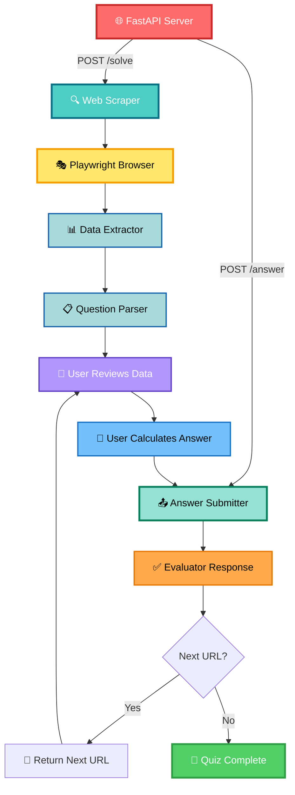

# FinalP2

<div align="center">


### 🤝 An interactive manual quiz solver that helps you complete the **IIT Madras TDS: Tools in Data Science – LLM Analysis Quiz Project**

[](https://www.linkedin.com/in/ayusman-samasi/)
[](https://github.com/Hariswar8018)

</div>

---

## 📋 Table of Contents

- [✨ Features](#-features)
- [🏗 Architecture](#-architecture)
- [⚙️ Setup & Installation](#️-setup--installation)
- [🚀 Deployment Guide](#-deployment-guide)
- [🌐 API Endpoints](#-api-endpoints)
- [💡 Usage Examples](#-usage-examples)
- [🧪 Testing](#-testing)
- [🤝 Contributing](#-contributing)
- [📄 License](#-license)
- [👤 Author](#-author)

---

## ✨ Features

<table>
<tr>
<td width="50%">

### 🎯 Manual Quiz Navigation
- ✅ Fetches quiz questions from URLs
- ✅ Displays instructions and data clearly
- ✅ Allows you to submit answers manually
- ✅ Handles multi-step question chains
- ✅ Provides next URL after each submission

</td>
<td width="50%">

### 🌐 Advanced Scraping
- 🔍 Uses Playwright Chromium for JS-heavy pages
- 📊 Extracts tables, text, and embedded content
- 🎵 Handles audio files and media content
- 📄 Processes dynamic web content
- 🔄 Renders JavaScript-based quiz pages

</td>
</tr>
<tr>
<td width="50%">

### 📊 Data Extraction
- 📁 Identifies CSV, JSON, HTML tables
- 🔢 Extracts numerical data from pages
- 🧹 Presents clean, structured data
- 📈 Highlights key information
- 🎨 Shows base64 encoded images/audio

</td>
<td width="50%">

### 💬 User-Friendly Interface
- 🖥️ Simple REST API endpoints
- 📤 Easy answer submission
- ✅ Clear success/error messages
- 🔗 Automatic URL chaining
- 📋 Detailed response feedback

</td>
</tr>
<tr>
<td width="50%">

### 🛠️ Developer Tools
- 🐳 Dockerized for easy deployment
- ☁️ Works on Render, Railway, HF Spaces
- 💓 Health monitoring endpoints
- ⚡ Fast async processing
- 🔧 Easy to extend and customize

</td>
<td width="50%">

### 🏭 Production Ready
- 🚀 Optimized performance
- 🔐 Secure credential handling
- 📊 Comprehensive error handling
- 🔄 Automatic retry logic
- 📝 Detailed logging

</td>
</tr>
</table>

---

## 🏗 Architecture



---

## 📁 Project Structure

```
Manual-Quiz-Solver/
│
├── 🐍 main.py                # FastAPI server with /solve and /answer endpoints
├── 🔍 scraper.py             # Web scraping logic with Playwright
├── 📤 submitter.py           # Answer submission handler
├── 🛠️ tools/                 # Utility modules
│   ├── parser.py             # Data parsing utilities
│   └── extractor.py          # Content extraction helpers
│
├── 💾 session_store.py       # Session state management
├── 📋 requirements.txt
├── 📦 pyproject.toml
├── 🐳 Dockerfile             # Playwright + FastAPI environment
├── 📖 README.md
└── ⚙️ .env                   # Environment variables
```

---

## ⚙️ Setup & Installation

### 📋 Prerequisites

<div align="center">

| Requirement | Version | Purpose |
|------------|---------|---------|
| 🐍 Python | 3.10+ | Core runtime |
| 🎭 Playwright | Latest | Browser automation |
| 🔑 Credentials | - | IITM email & secret |
| 🐳 Docker | Latest | Containerization |

</div>

### 🛠 Local Development

#### 1️⃣ Clone the Repository

```bash
git clone https://github.com/Hariswar8018/Manual-Quiz-Solver.git
cd Manual-Quiz-Solver
```

#### 2️⃣ Install Dependencies

**Using pip:**
```bash
pip install -r requirements.txt
playwright install chromium
```

**Using uv (⚡ recommended):**
```bash
pip install uv
uv sync
uv run playwright install chromium
```

#### 3️⃣ Create `.env` file

```env
EMAIL=your_iitm_email@ds.study.iitm.ac.in
SECRET=your_secret_key
```

> ⚠️ **Important**: Use your actual IITM credentials

#### 4️⃣ Run Server

```bash
uv run main.py
```

🎉 Server starts at: **http://localhost:7860**

---

## 🚀 Deployment Guide

### 🌐 Deploy on Render

<details>
<summary>Click to expand step-by-step instructions</summary>

#### Step 1: Create Web Service
1. Go to [Render Dashboard](https://dashboard.render.com/)
2. Click **"New +"** → **"Web Service"**
3. Connect your GitHub repository

#### Step 2: Configure Service

| Setting | Value |
|---------|-------|
| **Name** | `manual-quiz-solver` |
| **Environment** | `Docker` |
| **Region** | Choose nearest |
| **Branch** | `main` |

#### Step 3: Docker Configuration

```yaml
Dockerfile Path:       ./Dockerfile
Docker Build Context:  .
```

> 💡 Leave "Docker Command" **empty** - it's handled in Dockerfile

#### Step 4: Add Environment Variables

```bash
EMAIL=your_iitm_email@ds.study.iitm.ac.in
SECRET=your_secret_key
```

> 🔐 **Never commit these to GitHub!**

#### Step 5: Health Check

```
Health Check Path:  /healthz
```

#### Step 6: Deploy! 🚀

Click **"Create Web Service"** and wait 5-10 minutes for deployment.

</details>

### 🚂 Deploy on Railway

<details>
<summary>Click to expand Railway deployment guide</summary>

1. Create new project → **"Deploy from GitHub"**
2. Railway auto-detects Docker configuration
3. Add environment variables in **"Variables"** tab
4. Click **"Deploy"**

Railway will automatically:
- Build the Docker image
- Install Playwright + Chromium
- Start the FastAPI server
- Assign a public URL

</details>

---

## 🌐 API Endpoints

### 🎯 POST `/solve`

Fetches a quiz question and displays the content for manual solving.

**Request:**
```json
{
  "email": "22f3001994@ds.study.iitm.ac.in",
  "secret": "your_secret",
  "url": "https://tds-llm-analysis.s-anand.net/demo2?email=22f3001994@ds.study.iitm.ac.in"
}
```

**Response:**
```json
{
  "status": "ok",
  "instructions": "Calculate the sum of all values in column A",
  "data": {
    "table": [...],
    "files": [...],
    "text_content": "..."
  },
  "submit_url": "https://tds-llm-analysis.s-anand.net/submit",
  "message": "Review the data and submit your answer using /answer endpoint"
}
```

### 📤 POST `/answer`

Submits your manually calculated answer to the quiz evaluator.

**Request:**
```json
{
  "answer": "43592866",
  "submit_url": "https://tds-llm-analysis.s-anand.net/submit"
}
```

**Response (Correct Answer):**
```json
{
  "status": "submitted",
  "correct": true,
  "reason": "",
  "next_url": "https://tds-llm-analysis.s-anand.net/demo2-checksum?email=22f3001994%40ds.study.iitm.ac.in&id=76236",
  "next_url_decoded": "https://tds-llm-analysis.s-anand.net/demo2-checksum?email=22f3001994@ds.study.iitm.ac.in&id=76236",
  "message": "Open next_url_decoded in browser or use /solve with the next URL"
}
```

**Response (Wrong Answer):**
```json
{
  "status": "submitted",
  "correct": false,
  "reason": "The answer is incorrect. Please check your calculations.",
  "message": "Review your answer and try again"
}
```

### 💓 GET `/healthz`

Health check endpoint for monitoring services.

**Response:**
```json
{
  "status": "ok",
  "uptime_seconds": 120
}
```

---

## 💡 Usage Examples

### 📚 Complete Workflow

#### **Step 1: Fetch the First Question**

```bash
curl -X POST http://localhost:7860/solve \
  -H "Content-Type: application/json" \
  -d '{
    "email": "22f3001994@ds.study.iitm.ac.in",
    "secret": "your_secret",
    "url": "https://tds-llm-analysis.s-anand.net/demo2?email=22f3001994@ds.study.iitm.ac.in"
  }'
```

**You receive:**
- 📋 Instructions
- 📊 Data tables/files
- 🔗 Submit URL

---

#### **Step 2: Calculate Your Answer Manually**

Review the data provided and perform your calculations using:
- 🐍 Python scripts
- 📊 Excel/Google Sheets
- 🧮 Manual calculation
- 📈 Any data analysis tool you prefer

---

#### **Step 3: Submit Your Answer**

```bash
curl -X POST http://localhost:7860/answer \
  -H "Content-Type: application/json" \
  -d '{
    "answer": "43592866",
    "submit_url": "https://tds-llm-analysis.s-anand.net/submit"
  }'
```

**Response:**
```json
{
  "status": "submitted",
  "correct": true,
  "reason": "",
  "next_url": "https://tds-llm-analysis.s-anand.net/demo2-checksum?email=22f3001994%40ds.study.iitm.ac.in&id=76236",
  "next_url_decoded": "https://tds-llm-analysis.s-anand.net/demo2-checksum?email=22f3001994@ds.study.iitm.ac.in&id=76236",
  "message": "Open next_url_decoded in browser or use /solve with the next URL"
}
```

---

#### **Step 4: Continue to Next Question**

Use the `next_url_decoded` value from Step 3:

```bash
curl -X POST http://localhost:7860/solve \
  -H "Content-Type: application/json" \
  -d '{
    "email": "22f3001994@ds.study.iitm.ac.in",
    "secret": "your_secret",
    "url": "https://tds-llm-analysis.s-anand.net/demo2-checksum?email=22f3001994@ds.study.iitm.ac.in&id=76236"
  }'
```

**Repeat Steps 2-4 until quiz is complete!** 🎉

---

### 🎮 Alternative: Browser Workflow

You can also use the `next_url_decoded` directly in your browser:

1. 🌐 Open `next_url_decoded` in your browser
2. 📝 View the question
3. 🧮 Calculate manually
4. 📤 Submit using `/answer` endpoint

---

## 🧪 Testing

### 📡 Test Quiz URLs

Try these test endpoints with varying complexity:

| 🔗 URL | 📊 Questions | ⏱️ Difficulty |
|--------|--------------|---------------|
| [Demo Quiz](https://tds-llm-analysis.s-anand.net/demo) | 3 | 🟢 Easy |
| [Demo 2 Quiz](https://tds-llm-analysis.s-anand.net/demo2) | 2 | 🟢 Easy |
| [P2 Testing](https://p2testingone.vercel.app/q1.html) | 20 | 🟡 Medium |
| [Basic Test](https://tdsbasictest.vercel.app/quiz/1) | 10 | 🟡 Medium |
| [Extra Test](https://tdsextratest.vercel.app/quiz/1) | 10 | 🟠 Hard |

### 📝 Example Test Sequence

```bash
# Step 1: Get first question
curl -X POST http://localhost:7860/solve \
  -H "Content-Type: application/json" \
  -d '{
    "email": "your_email@ds.study.iitm.ac.in",
    "secret": "your_secret",
    "url": "https://tds-llm-analysis.s-anand.net/demo"
  }'

# Step 2: Calculate answer manually (e.g., "42")

# Step 3: Submit answer
curl -X POST http://localhost:7860/answer \
  -H "Content-Type: application/json" \
  -d '{
    "answer": "42",
    "submit_url": "https://tds-llm-analysis.s-anand.net/submit"
  }'
```

---

## 🧠 How the System Works

```
┌─────────────────────────────────────────────────────────────┐
│                    🤝 Manual Workflow                        │
└─────────────────────────────────────────────────────────────┘

    1️⃣  User calls /solve with quiz URL
         ↓
    2️⃣  System fetches page using Playwright
         ↓
    3️⃣  System extracts instructions + data
         ↓
    4️⃣  System returns structured data to user
         ├── 📋 Instructions
         ├── 📊 Tables/Files
         ├── 🔗 Submit URL
         └── 📝 Raw content
         ↓
    5️⃣  👤 User manually analyzes data
         ↓
    6️⃣  👤 User calculates answer
         ↓
    7️⃣  User calls /answer with their solution
         ↓
    8️⃣  System submits to evaluator
         ↓
    9️⃣  System returns evaluator response
         ├── ✅ Correct/Incorrect status
         ├── 💬 Feedback message
         └── 🔗 Next URL (if available)
         ↓
    🔟  If next URL exists, repeat from step 1
         └── Otherwise, quiz complete! 🎉
```

### 🛡️ Robust Features

- ⏱️ Timeout management for slow pages
- ❌ Clear error messages
- 🔗 Automatic URL chaining support
- 📁 Multiple file format handling
- 🔄 Session state management

---

## 🤝 Contributing

We welcome contributions! Here's how you can help:

### 🌟 Ways to Contribute

- 🐛 Report bugs and issues
- 💡 Suggest new features
- 📝 Improve documentation
- 🔧 Submit pull requests
- ⭐ Star the repository

### 📬 Pull Request Process

1. 🍴 Fork the repository
2. 🌿 Create your feature branch
   ```bash
   git checkout -b feature/AmazingFeature
   ```
3. 💾 Commit your changes
   ```bash
   git commit -m '✨ Add some AmazingFeature'
   ```
4. 📤 Push to the branch
   ```bash
   git push origin feature/AmazingFeature
   ```
5. 🎉 Open a Pull Request

### 📋 Contribution Guidelines

- Follow existing code style
- Add tests for new features
- Update documentation
- Use descriptive commit messages
- Keep PRs focused and small

---

## ✨ Design Choices

<table>
<tr>
<td>

### 🎯 Technology Stack
- **Playwright** → JS-rendered quiz pages
- **FastAPI** → Modern async web framework
- **Docker** → Reproducible environments
- **REST API** → Simple integration

</td>
<td>

### 🏗️ Architecture Decisions
- **Two-endpoint design** → Clean separation
- **Stateless operations** → Easy scaling
- **UV package manager** → Fast dependencies
- **Modular structure** → Easy maintenance

</td>
</tr>
</table>
